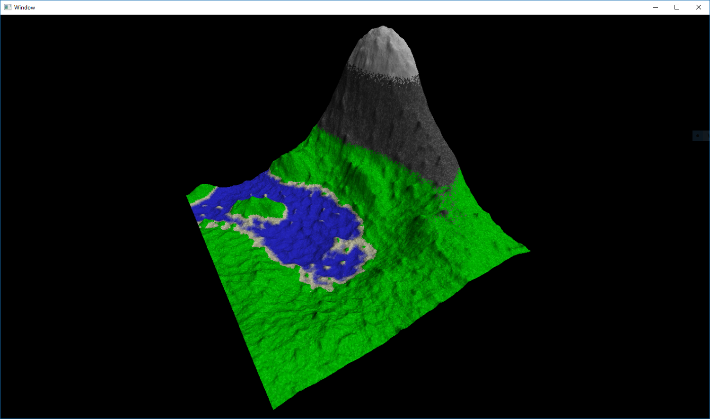

# 3D Procedural Terrain (Low-Poly Game)

A 3D game in OpenGL and C++ to procedurally generate realistic terrain.

Libraries used:
	- GLEW (OpenGL Extension Wrangler)
	- GLFW (OpenGL Framework)
	- GLM (OpenGL Mathmatics Library)
